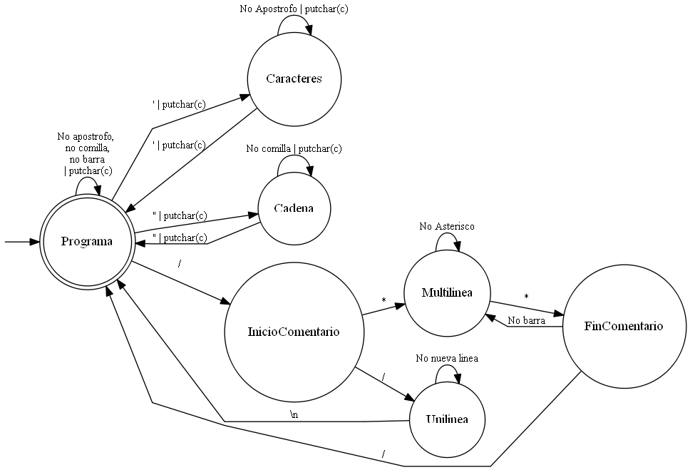

# **Asignatura:** Sintaxis y Semantica de los Lenguajes de Programacion
## **Curso:** K2051
## **Año de cursada:** 2017
## **Numero de equipo:** 5

## **Integrantes**

### Tomas Benz	|	tomasbenz	
### Ignacio Campaño	| IgnacioCampano
### Martín DiPaolo	| martindipaolo
### Emiliano Guiggiaro	| eguiggiaro
### Agustin Yañez	| agustinyanez

## **TP:** 3 - Removedor de comentarios

***
### Autómata finito

* Diagrama de transiciones

	

* Definición formal

M = (Q, E, T, q0, F), dónde:

	* Q = {Programa,Caracteres, Cadena, InicioComentario, Multilinea, Unilinea, FinComentario};
	* E = {caracteres y símbolos ASCII};
	* q0 = Programa;
	* F = {Programa};
	* T = {Programa => ' => Caracteres, Caracteres => ' => Programa, Caracteres =>  No apóstrofo => Caracteres, Programa => \ => Cadena, Cadena => \ => Programa, Cadena => No comilla => Cadena, Programa => / => InicioComentario, InicioComentario => * => Multilinea, InicioComentario => / => Unilinea, Multilinea => No asterisco => Multilinea, Unilinea => No nueva línea => Unilinea, Multilinea => * => FinComentario, FinComentario => No barra => Multilinea, FinComentario => / => Programa, Programa => {No apostrofo, No comilla, No barra} => Programa, Unilinea => \n => Programa}.

* Expresión regular

	* Cadena: "[^"]*"
	* Caracteres: '[^']*' 
	* Comentario simple (Unilinea):  [^"']\/\/[^\/\/]*[\n]+[^"']
	* Comentario multilinea: [^"']\/\*(\*(?!\/)|[^*])*\*\/[^"']

***
### Descripción de la implementación A: rc-a.c.

La implementación A se basa en el autómata descripto, y utiliza etiquetas GOTO para hacer efectivas las transiciones.

Dentro de cada etiqueta (relacionadas con los estados correspondientes) se utilizó la sentencia switch para validar el carácter de la transición, y el estado final correspondiente. 

En la implementación, el final de la ejecución está representado por el fin del archivo (EOF).

***
### Descripción de la implementación B: rc-b.c.

La implementación B se basa en el autómata descripto, y utiliza recursividad para hacer efectivas las transiciones.

Dentro de cada función (relacionadas con los estados correspondientes) se utilizó la sentencia switch para validar el carácter de la transición, y el estado final correspondiente. 

En la implementación, el final de la ejecución está representado por el fin del archivo (EOF).
 

***

### Benchmark

Implementación | KB | MB | GB
-- | --
A | 12 seg | 12 seg | 12 seg
B  | 12 seg | 12 seg | 12 seg

Cabecera A | Cabecera B
-- | --
Campo A0 | Campo B0
Campo A1 | Campo B1